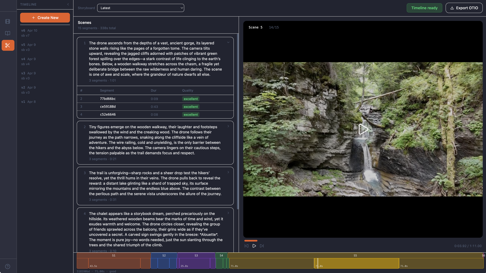

# ai-video-cutter



An automated video editing system that turns raw footage into polished edits in minutes. It segments footage using computer vision, writes a narrative storyboard with LLM agents, and assembles a timeline leveraging CV tools and LLMs. The timeline can be exported as an [OpenTimelineIO](https://opentimeline.io/) file ready for any NLE.

---

## How it works

```
Raw footage
    │
    ▼
Video Pipeline          — downsample → optical flow → scene segmentation → VLM descriptions
    │
    ▼
Storyboard Agent        — multi-agent: story writer → narrative judge → director
    │
    ▼
Editor Agent            — multi-agent: embedding index → clip selection → assembly → review
    │
    ▼
Export (.otio)          — OpenTimelineIO file for Resolve, Premiere, Final Cut, etc.
```

The whole flow is driven through a React web UI. Processing is handled by three specialized Celery worker pools so video, VLM, and LLM work run concurrently without blocking each other.

---

## Local setup

### Prerequisites

- [Docker](https://docs.docker.com/get-docker/) and Docker Compose v2
- API keys (see below)

### 1. Clone and configure

```bash
git clone <repo-url>
cd ai-video-cutter
cp .env.example .env
```

Open `.env` and fill in your keys:

```dotenv
# Required — VLM segment descriptions
GEMINI_API_KEY=your-gemini-api-key-here

# Required — at least one LLM provider for the storyboard / editor agents
MISTRAL_API_KEY=your-mistral-api-key-here
ANTHROPIC_API_KEY=your-anthropic-api-key-here
OPENAI_API_KEY=your-openai-api-key-here

# Required — absolute path to the projects folder on your host machine
# Used so exported .otio files reference the correct file:// URLs
HOST_STORAGE_ROOT=/absolute/path/to/ai-video-cutter/local/data/projects
```

The other values in `.env.example` have sensible defaults and can be left as-is for local use.

### 2. Start the stack

```bash
./start.sh
```

This will:
1. Verify `.env` exists (copies from `.env.example` and exits if not)
2. Create `local/data/projects/` for persistent project storage
3. Build and start all services with `docker compose up --build`

For **development** (Vite HMR on port 5173 instead of the compiled nginx build):

```bash
./start.sh --dev
```

### 3. Open the UI

| Service | URL |
|---|---|
| Frontend | http://localhost:3001 |
| API docs | http://localhost:8000/docs |
| Flower (task monitor) | http://localhost:5555 |
| Vite dev server (dev mode) | http://localhost:5173 |

---

## Services overview

```
┌─────────────────────────────────────────────────────────┐
│  Browser  →  frontend :3001 (nginx)                     │
│             ↕                                           │
│           api :8000 (FastAPI, 2 workers)                │
│             ↕                                           │
│          redis :6380 (broker + results)                 │
│           ↙    ↓     ↘                                  │
│  celery-video  celery-vlm  celery-agents                │
│  (CPU queue)  (gevent I/O)  (LLM queue)                 │
└─────────────────────────────────────────────────────────┘
```

Project data is persisted to `./local/data/projects/` on the host.

---

## CLI usage

The CLI bypasses the web UI and runs pipeline steps directly. Useful for scripting or batch processing.

```bash
# Install dependencies (Python 3.11+)
pip install -e ".[api,worker]"

# Create a project
python cli.py create my-project

# Run segmentation pipeline (add --describe for VLM descriptions)
python cli.py process my-project path/to/video.mp4 --describe

# Generate storyboard
python cli.py storyboard my-project

# Assemble timeline
python cli.py edit my-project

# Export to .otio
python cli.py export my-project
```

---

## Configuration

Global defaults live in `config/default.yaml`. Each project gets its own copy at `{project}/config.yaml`, which you can edit to tune segmentation sensitivity, VLM model, or LLM providers per project.

Key settings:

| Section | What to tune |
|---|---|
| `video.downsample` | Target fps and width for processing |
| `video.segmentation` | Changepoint penalty — higher = fewer, longer segments |
| `vlm` | Gemini model and rate limit |
| `storyboard.agents.*` | LLM model + temperature for each agent role |
| `editor.agents.*` | Embedding model, retrieval params, transition cost weights |

---

## Documentation

- [docs/config.md](docs/config.md) — full config reference with all fields, types, defaults, and tuning notes
- [docs/api.md](docs/api.md) — full API reference with all endpoints, request/response schemas
